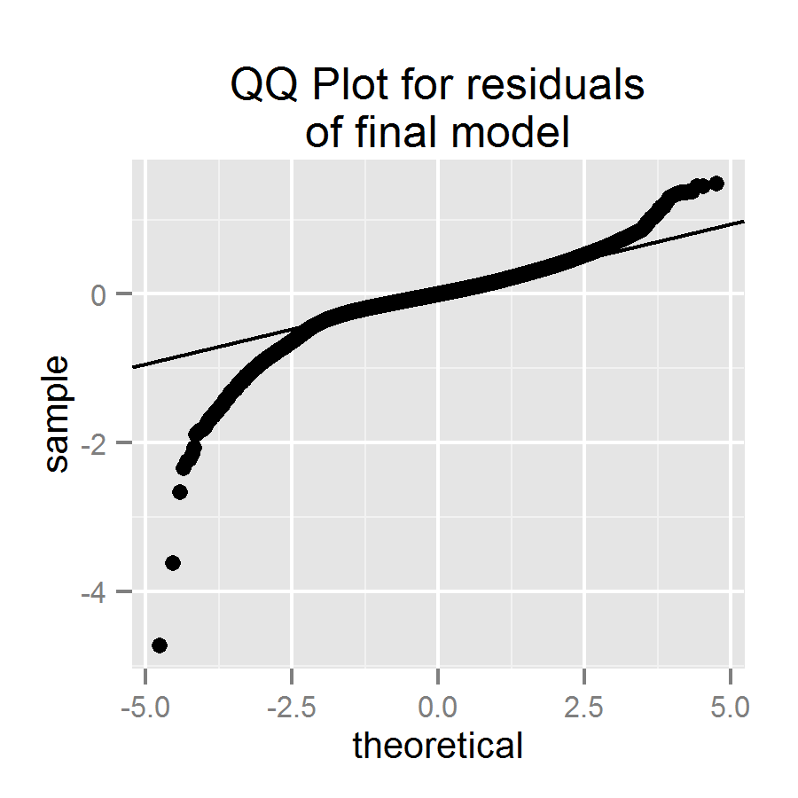
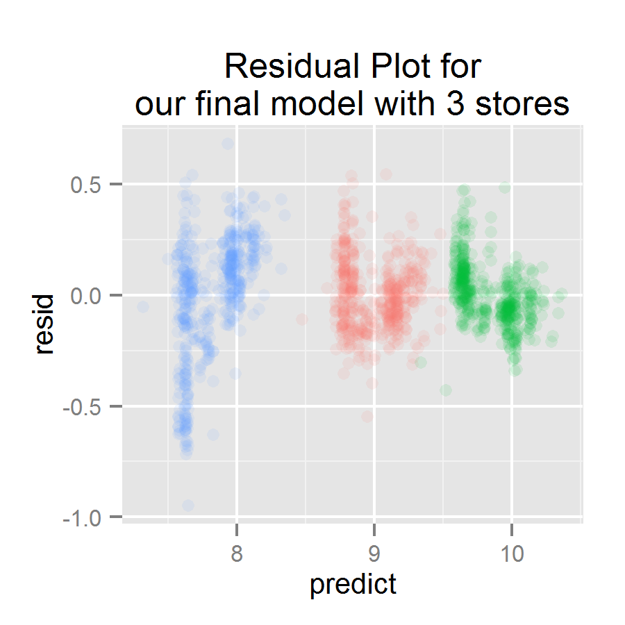

\newpage

# Overview

Rossmann is a German drugstore chain which operates over 3,000 drug stores in 7 European countries. In order to schedule staff effectively, store managers need to predict their daily sales for six weeks in advance.  Rossman decided to create a Kaggle competition to find a satisfactory prediction model.

For our project, our team joined this contest and created a model based on the historical data provided by Rossman.  We used R for data exploration and manipulation, to create linear regression models, and to validate our results.   

MORE HERE - TELL THE CONCLUSION, THEN SHOW HOW WE GOT THERE

```{r, echo=FALSE, warning=FALSE, message=FALSE}

##################
# Step 1 - Setup #
##################

rm(list = ls())

# Choose your data
desired_data <- "dataTraining_full.csv"

## Set the pwd
pwd <- "C:\\Users\\Jennifer\\Documents\\COURSES\\STAT_139_Modelling\\project\\Stat-139\\"

#install.packages("lubridate")
library (lubridate) # date simplification
#install.packages("lme4")
library (lme4) # random effects
#install.packages("ggplot2")
library(ggplot2)
#install.packages("reshape2")
library(reshape2) # critical for "melting"
#install.packages("MASS")
library(MASS) # critical for the qqplots with lines!
theme_set(theme_gray(base_size = 10))

source(paste(pwd, "RossmannProject_GetData.R", sep=""))

######################################
# Step 2 - Transform and Derive Data #
######################################       

if(!file.exists(paste(pwd, desired_data, sep=""))) 
{
    getFullData(pwd)
}
dataTraining <- read.csv(paste(pwd, desired_data, sep=""), header=T)
dataTraining <- dataTraining[,-1] # remove row numbers
dataTraining$YearFactor <- as.factor(dataTraining$YearFactor)
```

# The Data

The Rossmann data consisted of two files which, together, provided information about 942 days of sales at 1,115 stores.  The first file contained store-level data such as:

* Type of store (in terms of its "model" and its overall selection)
* Information about the closest competitor (distance and longetivity)
* Information about that store's particular promotion cycle

The second file contained daily data for each store for 2013, 2014, and the first part of 2015. This data consisted of items such as:

* date (also noting that date's exact weekday, holiday status, and school holiday status)
* whether or not that particular store was open that particular day
* whether or not the store was running a promotion that day
* sales amount and number of customers

Our first step was to combine the two datasets into one flat file.  We also converted certain variables to strings and factors to prevent R from treating them as numerics.  Then, after using all of the data to derive all additional variables, we removed the rows of "closed day" data.  After all, the stores consistently posted zero sales when closed, and our model is to predict sales when open.

## Derived Data

While the Rossman-provided data had a huge number of records, we saw the opportunity to add several interesting columns.  For example:

* We converted the rather esoterically-delivered promotion information to determine on exactly which days each store ran exactly how many promotions.
* We analyzed the distribution of distance between stores and their nearest competitors, and derived a _Close Competitor_ variable for those with the 10% nearest Competitors.
* We analyzed which stores had summer sales that were at least 150% the level of winter sales, and hypothesized that these might be seasonal, coastally-located stores deserving a special indicator variable we called _Summer Boost_.
* We noticed that some stores were completely closed for long stretches of time within our dataset, and hypothesized that perhaps, after a lengthy renovation, sales would increase due to a "buzz".  However, we made our _Reopened_ dummy variable even more subtle than that - it applied to a certain number of days after a store reopened, proportional to the amount of time a store had been closed.  Therefore, whether it was due to a huge renovation or just a long weekend which forced loyal clients to wait to restock their homes, _Reopened_ would capture both possible boosts to sales.
* For the years of data after the first year of data, we added a year-to-year _Prior Daily Average_ variable that was a backwards look at each particular store's average daily sales in the prior calendar year.  However, as this then limited our model to run on two-thirds of our data, it was not very popular within the team.
* Most significantly, we analyzed the dates within our dataset and added several dummy and factor-level variables to distinguish some dates from others.  We combined the school calendar information with basic knowledge of the seasons to create a rather specific _Season_ variable - some periods of time fall under relatively generic terms such as "Spring", or "Fall Break", while other dates are assigned a factor-level as specific as "Christmas Eve".
  
_(Please see the appendix for the complete list of all variables, both original and derived.)_

## Checking the Independence Assumption

As previously mentioned, Grossman's data observations cover 942 days of sales for 1,115 stores. As a result, many of the data points are clustered by store:

``````{r, echo=FALSE, warning=FALSE, message=FALSE, eval=FALSE}

dset <- dataTraining[dataTraining$StoreFactor %in% c("Store199", "Store251", "Store307") & dataTraining$Month == "April", ]

vplot <- ggplot(data=dset, aes(x=Date, y=LogSales, color=factor(StoreFactor))) +  
    geom_point() + theme(legend.title=element_blank()) +
    labs(title = paste("Scatterplot of Log Sales\nFor Three Stores in April", sep=""))
ggsave(file = paste("StoreClusters.png", sep=""), height = 3)
```


Any linear model not taking this into account would have residuals that were not independent and so be invalid.  Therefore, we expanded our toolset to include a "random effects" model, as provided by the __lmer__ command in R's __lme4__ package.  Unlike R's more basic __lm__ approach, this model allows the predicted intercept for each store to vary, thereby "absorbing" the observed and unobserved differences between stores. In fact, it is even possible, with enough processing power, for a random effects model to allow the slopes of certain variables to vary by store as well.  

Unfortunately for us, a full, varied-slope random effects model required more processing power than any of us had at our disposal. However, we found it reasonable to hope that even the basic, intercept-only, random effects model could overcome this violation of independence within our dataset.

\newpage

## Checking the Normality Assumption

Our dataset contained remarkably few quantititive variables - most of the information was about various categorizations.  However, those few quantitative variables still required some transformations so that our statistical tools could be accurate.  _Sales_, the response variable, and _Distance from Competition_ were both right-skewed until a log transformation was applied.  However, the total _Number of Promotions_ offered by a store at any one time was originally reasonably symmetric.

```{r, echo=FALSE, warning=FALSE, message=FALSE, eval=FALSE}

# need dataTraining_full
dset <- subset(dataTraining, select=c(ID, Sales, LogSales, CompetitionDistance, LogCompDistance, NumPromos))
dset <- melt(dset)
vplot <- ggplot(dset[,-1],aes(x = value)) + 
    facet_wrap(~variable, scales = "free", ncol=2) + 
    geom_histogram()
ggsave(file = paste("Normality.png", sep=""))
```


As mentioned before, our _PriorDailyAverage_ variable applies only for the second year on of our data, as the first year's data becomes summary information.  Therefore, we look at that subset of data to evaluate this variable's normality, and again decide to perform a log transformation:  
  
```{r, echo=FALSE, warning=FALSE, message=FALSE, eval=FALSE}
dset <- subset(dataTraining, YearFactor %in% c(2014, 2015), select=c(ID, PriorDailyAvg, LogPriorDailyAvg))
dset <- melt(dset, id.vars="ID")
vplot <- ggplot(dset,aes(x = value)) + 
    facet_wrap(~variable, scales = "free", ncol=2) + 
    geom_histogram()
ggsave(file = paste("Normality_PS.png", sep=""), height = 3)
```


## Checking the Linearity Assumption

Next, we looked at scatterplots of our response variable, _LogSales_, against each of our quantitative predictor variables: the log of the distance to the closest competitor, the number of promotions at any one time, and the log of the prior year's average daily sales.  Happily, we did not see any evidence of nonlinearity:

```{r, echo=FALSE, warning=FALSE, message=FALSE, eval=FALSE}
dset <- melt(dataTraining[ , c("LogSales", "LogCompDistance", "NumPromos")], id.vars = "LogSales")

vplot <- ggplot(dset, aes(x=value, y=LogSales)) + 
    facet_wrap(~variable, scales = "free", ncol=2) + 
    geom_point(alpha=0.05)
ggsave(file = paste("Linearity.png", sep=""), height = 3)
```


```{r, echo=FALSE, warning=FALSE, message=FALSE, eval=FALSE}
dset <- melt(subset(dataTraining, YearFactor %in% c(2014, 2015), select=c(LogSales, LogPriorDailyAvg)), id.vars = "LogSales")
vplot <- ggplot(dset, aes(x=value, y=LogSales)) +  
    geom_jitter(alpha=0.05, position = position_jitter(width = 0.1))
ggsave(file = paste("Linearity_PS.png", sep=""), height = 3)
```


## Imagining Interaction Terms

Even though we are not expert in the drugstore business, we knew we needed several interaction variables to allow for different slopes for certain variables under certain conditions.  For example, we needed to allow the summer season to have a different magnitude of effect if a store seemed to be a seasonal summer destination, compared to all of the other stores in Germany.  We needed to ensure that the distance from the closest competitor could only matter if that competitor was already open for business.  

Although we imagined many more interaction terms as well, we unfortunately ran into the limits of our processing power rather quickly with these models.  As a result, we made do with the two mentioned above. 

# Creating the Model

## Process

Once we had all of our variables in place, we created the simplest __baseline model__ we could imagine.  Then, we created a __full model__, which was allowed to include all of our contributed variables and interaction terms as well.  Lastly, we compared the two in terms in terms of prediction and reliability.

## Baseline Model

The simplest baseline model we could imagine is that each store continues to have sales at the same rate as in the prior year, as based on the prior year's daily average.  Given our data, of course, we deal with log values for these variables:

$LogSales = \beta_0 + \beta_1 LogPriorDailyAverage$, where $\beta_0 = 0$ and $\beta_1 = 1$.

```{r, echo=FALSE, warning=FALSE, message=FALSE}
dumb <- dataTraining[dataTraining$YearFactor != 2013, c("StoreFactor", "LogSales", "LogPriorDailyAvg")]
dumb$dumbest_resid <- dumb$LogSales - dumb$LogPriorDailyAvg
```

When we run this model against our data for (only) the years 2014 and 2015, we find that the standard error of the residuals is `r sd(dumb$dumbest_resid)` and our residuals range from `r range(dumb$dumbest_resid)[1]` to `r range(dumb$dumbest_resid)[2]`.  

If our model is valid, then we should observe normality of the residuals, constant variance of the residuals, and linearity between the residuals and the fitted values, and these assumptions should hold true both overall and at the store-specific level.

```{r, echo=FALSE, warning=FALSE, message=FALSE, eval=FALSE}
vplot <- ggplot(dumb, aes(sample = dumbest_resid)) + 
    stat_qq() + 
    geom_abline(aes(intercept = mean(dumbest_resid), slope = sd(dumbest_resid)), data = dumb) +
    labs(title="Baseline Model\nResidual QQ Plot")
ggsave(file = paste("Dumbest_QQ.png", sep=""), height=3, width=3)

vplot <- ggplot(dumb, aes(LogPriorDailyAvg, dumbest_resid)) + 
    geom_point(alpha=.05) + stat_smooth() + 
    labs(title="Baseline Model\nResidual Plot")
ggsave(file = paste("Dumbest_ResidFit.png", sep=""), height=3, width=3)
```
 

The above plots show our overall residuals for the entire model.  The below plots highlight store-specific residuals for three representative stores:

```{r, echo=FALSE, warning=FALSE, message=FALSE, eval=FALSE}
dumb <- dumb[which(dumb$Store %in% c("Store199", "Store251", "Store307")), ]
vplot <- ggplot(dumb, aes(sample = dumbest_resid, color=factor(StoreFactor))) + 
    stat_qq() + theme(legend.position="none") +
    geom_abline(aes(intercept = mean(dumbest_resid), slope = sd(dumbest_resid)), data = dumb) +
    labs(title="Baseline Model\nResidual QQ Plot, 3 stores")
ggsave(file = paste("Dumbest_QQ_3Store.png", sep=""), height=3, width=3)

vplot <- ggplot(dumb, aes(LogPriorDailyAvg, dumbest_resid, color=factor(StoreFactor))) + 
    geom_point(alpha=.05) + theme(legend.position="none") +
    labs(title="Baseline Model\nResidual Plot, 3 stores")
ggsave(file = paste("Dumbest_ResidFit_3Store.png", sep=""), height=3, width=3)
```

 

\newpage

Overall, our residuals are somewhat right-skewed.  This means that this simple model tends to underpredict daily sales at each store as based on last year's average sales -- and perhaps this could be attributed to simple inflation. Looking at the residual plot, we see that our residuals do seem to show constant variance in a nicely even random cloud formation. As the cloud follows a perfectly flat line around zero, we see no evidence of non-linearity.  

While the QQ Plot of the small subset of data for three specific stores shows greater departures from normality per-store, each store is different and still reasonably close to the line.  The Residual Plot is interesting:  each store does seem to have its own level of variance around the mean, and one store seems to tend to be underpredicted while another store tends to be overpredicted.

These assumption checks did not have perfect results.  Instead, they confirmed that we should apply a store-specific random effects model to predict sales at the various Rossman stores across Germany. 

## Full Model

To create our full random effects model, we first identified the subset of variables which had weight in explaining sales by running a simple __lm__ model on the average prior daily average (as used in our baseline model), plus many others:

* factor variables for the year, the day of the week, and our extensively-specific _Season_ variable, 
* factor variables about the type of store and the type of selection of goods it offers,
* indicator variables for summer seasonality, stores that were regularly open on Sundays, stores that had recently reopened after a relatively lengthy period of time,
* indicator and quantitative variables about how many promotions the store ran each day, and the type of promotion, and
* an interaction term about the existence of competition combined with the distance from that competition, and an indicator term about whether or not this store was "extra close" to its competition.
                
```{r, echo=FALSE, warning=FALSE, message=FALSE}
dataTraining$Interact_SummerBoost <- dataTraining$SummerMonthDummy * dataTraining$SummerBoost
dataTraining$Interact_Competitor <- dataTraining$CompetitionOpen * dataTraining$LogCompDistance

full <- dataTraining[dataTraining$YearFactor != 2013, c("LogSales", "YearFactor", "Season", 
                "DayOfWeek_Named", "Interact_SummerBoost", "SundayOpen", "Reopened", 
                "StoreType", "Assortment", "Promo", "Promo2Active" , "NumPromos", 
                "Interact_Competitor", "CloseCompetitor", "LogPriorDailyAvg")]

pick_vars <- lm(full)
#summary(pick_vars)

full <- dataTraining[dataTraining$YearFactor != 2013, c("LogSales", "StoreFactor", 
        "YearFactor", "Season", "DayOfWeek_Named", "Interact_SummerBoost", "SundayOpen", 
        "StoreType", "Assortment", "Promo", "Interact_Competitor", "CloseCompetitor", 
        "LogPriorDailyAvg")]

```

The results of our basic model helped us to weed out a few promotion-oriented variables as well as _Reopened_.  The code for our final model was thus

```{r, warning=FALSE, message=FALSE}
final <-  lmer ( LogSales ~ YearFactor + Season + DayOfWeek_Named + Interact_SummerBoost + 
                     SundayOpen + StoreType + Assortment + Promo + Interact_Competitor + 
                     CloseCompetitor + LogPriorDailyAvg + (1|StoreFactor), data = full )

```
```{r, warning=FALSE, message=FALSE, echo=FALSE, eval=FALSE}
summary(final)
```

which results in the following equation:

\newpage

_Log Sales_ = 5.02 + .43 _Log Prior Avg Sales_ - .10 _Open Sunday_ + .05 _Close Competitor_
                - .01 _Competitor Distance_ + .43 _Summer Boost_ + .34 _Promo_ 
                + .01 $Year_{2015}$ + ... 

|_Store Type_|_Assortment_| _Day of Week_    | _Season_                           |
|:-----------|:-----------|:-----------------|:-----------------------------------|
|  a: 0.00   | a:  0.00   | Monday:     0.11 | Easter Holiday:               0.28 |
|  b: 0.44   | b: -0.09   | Tuesday:   -0.01 | Easter Break:                -0.07 |
|  c: 0.01   | c:  0.09   | Wednesday: -0.06 | Spring:                      -0.15 |
|  d: 0.02   |            | Thursday:  -0.06 | Summer:                      -0.14 |
|            |            | Friday:     0.00 | Summer Break:                -0.17 |
|            |            | Saturday:  -0.05 | Fall:                        -0.15 |
|            |            | Sunday:    -0.11 | Fall Break:                  -0.20 |
|            |            |                  | Holiday Shopping:             0.05 |
|            |            |                  | Christmas Break:             0.00 |
|            |            |                  | Last Minute Holiday Shopping:  0.54 |
|            |            |                  | Christmas Eve:              -0.27 |
|            |            |                  | New Year's Eve:             -0.45 |
|            |            |                  | Public Holiday:             -0.21 |

Satisfyingly, these coefficients all make intuitive sense. Some specific observations:

* It is interesting to see what a huge magnitude of an effect merely the day of the week and the season have on a store's sales - competition, the assortment of goods the store offers, and the type of store it is (most of the time) hardly matter in comparison.
* December and the resulting school vacation, apart from New Year's Eve, are extremely huge drivers of the entire year's sales.  Other than that, only actual observed Easter holiday (and not the school's Easter-time break) manages to tax the store's capacity. 
* Shoppers do respond to the store's primary promotion!
* Being open on Sundays does not end up benefiting the bottom line by much - if a store is open on Sundays, all of its other days are slightly depressed as an effect, and, on top of that, the Sunday itself is still relatively quiet.
* Our hypothesis that close competion might actually boost sales is held up - we had posited that clusters of similar stores can attract more shoppers, and we see that having a close competitor does indeed boost sales.  The coefficient on _Competitor Distance_ is slightly ambiguous - do sales go down the farther away the competitor is, or is that that sales went down a bit because this store does actually have a competitor?

_(Please see the appendix for the complete coefficients table.)_

\newpage

### Assumptions Check

First, we will check the overall residuals of the model as a whole:

```{r, echo=FALSE, warning=FALSE, message=FALSE, eval=FALSE}
ER_fortified <- ggplot2::fortify(final)

vplot <- ggplot(ER_fortified, aes(sample = .resid)) + 
    stat_qq() + 
    geom_abline(aes(intercept = mean(.resid), slope = sd(.resid)), data = ER_fortified) +
    labs(title="QQ Plot for residuals\nof final model")
ggsave(file = paste("Final_QQ.png", sep=""), height=3, width=3)

vplot <- ggplot(ggplot2::fortify(final), aes(.fitted, .resid)) + 
    geom_point(alpha=.05) + stat_smooth() + 
    labs(title="Residual Plot for\nour final model")
ggsave(file = paste("Final_ResidFit.png", sep=""), height=3, width=3)
```
 

Unfortunately, in the QQ Plot, we see that our residuals are still right-skewed rather than normal.  Now that we have the year factor in our model, we cannot write this off as a failure to account for inflation year-to-year.  We also see a suspicious curve within the Residual Plot - while the overall shape is a nice cloud, and the line is quite close to zero, there is a slight arc to it that indicates nonlinearity.  We are not confident that we can confirm our assumptions.

Checking the same three stores we had used before as a representative sample, we see a suspicious pattern:

```{r, echo=FALSE, warning=FALSE, message=FALSE, eval=FALSE}
dset <- subset(full, select="StoreFactor")
dset$predict <- fitted(final)
dset$resid <- resid(final)
dset <- dset[which(dset$Store %in% c("Store199", "Store251", "Store307")), ]
#dset <- dset[which(dset$Store %in% c("Store19", "Store25", "Store30")), ]
vplot <- ggplot(dset, aes(sample = resid, color=factor(StoreFactor))) + 
    stat_qq() + theme(legend.position="none") + 
    geom_abline(aes(intercept = mean(resid), slope = sd(resid)), data = dset) +
    labs(title="QQ Plot for residuals\nof final model with 3 stores")
ggsave(file = paste("Final_QQ_3Store.png", sep=""), width=3, height=3)

vplot <- ggplot(dset, aes(x=predict, y=resid, color=factor(StoreFactor))) + 
    geom_point(alpha=.1) + theme(legend.position="none") 
    labs(title="Residual Plot for\nour final model with 3 stores")
ggsave(file = paste("Final_ResidFit_3Store.png", sep=""), width=3, height=3)
```
 

While the residuals seem to have somewhat improved normality, as compared to the baseline model, they seem highly nonlinear, as they have a per-store "U-Shape" rather than a cloud.

What lies behind this?  Remembering our regression model, there are many indicator values contained within it.  Sales vary per store quite dramatically by day and by season.  Perhaps this is why the predicted values per store tend to group at different discrete amounts, rather than forming an even cloud.  What about the variance?  For these three stores, it seems that the variance of the lower predictions is usually greater than the variance of higher predictions.  Is this true for all stores?  

We randomly sampled twenty more stores to see:

```{r, echo=FALSE, warning=FALSE, message=FALSE, eval=FALSE}
dset <- subset(full, select="StoreFactor")
dset$predict <- fitted(final)
dset$resid <- resid(final)
dset <- dset[dset$Store %in% c("Store912", "Store207", "Store142", "Store859", "Store463", "Store71", "", "Store648", "Store975", "Store686", "Store97", "Store551", "Store417", "Store531", "Store470", "Store1033", "Store348", "Store754", "Store1092", "Store1081", "Store433"), ]

vplot <- ggplot(dset, aes(x=predict, y=resid, color=factor(StoreFactor))) + 
    facet_wrap(~StoreFactor, scales = "free_x", ncol=4) + stat_smooth() + 
    geom_point(alpha=.1) + theme(legend.position="none") +
    labs(title="Residual Plots for 20 randomly selected stores")
ggsave(file = paste("Final_ResidFit_20Stores.png", sep=""))
```


Happily, we see that every store is indeed different when it comes to the distribution of its residuals and that, overall, the stores' residuals are linear and with a constant variance around the zero line.  

Taking the two views together, we conclude that the assumptions of linear regression seem to hold more than not.  However, we also see that a fuller random effects model may be truly useful - some of the stores' density lines do have slight slopes up or down, so that different store-specific slopes for at least some of the variables in our model might be appropriate.

### Performance as Compared to Baseline

We compared our final model to our baseline in a number of ways:

* Residual Standar Error
* R-squared
* Adjusted R-Squared
* AIC
* SSE

To evaluate the final model we compare the residual standard error (s^) of the baseline model to the final model. From the R summary of the baseline model we find $\sigma_{baseline}$ = XXX and for the final model $\sigma_{final}$ = XXX. The final model has a lower $\sigma^2$, benefiting slightly from the additional variables and interaction.

# Summary

XXX

## Particular Challenges

Outliers(or other appropriate name)

The baseline model has a few extreme outliers that no doubt impact our model and potentially could improve the some of the concerning patterns in our by store residual plots.  Due to the size of the dataset, we were unable to investigate all outliers thoroughly.  

Discussion of how we did find the Christmas Eve effect.

In fact, the large data set and number of predictors proved to be an issue for most of our inquiry. from trying to set up prediction intervals to attempting to identify which stores are being modeled well and which might need further attention, we were unable to apply many of the techniques that might work well on a smaller scale model.  Simply setting up the data for use took a significant portion of the project. [other issues you all had?]

## Conclusion

While we were able to explore many aspects of model building, the final model cannot actually be used to make economically-sound decisions for all Rossmann stores.  One clear improvement to the model might be to let the impact of our fixed effects vary by store.  For example, it is likely that the average increase is sales observed on Mondays is not the same across all stores. 

In addition, assumptions violations persist in our model. 

the shortcomings of the current project provide many opportunities for further inquiry.

# A Fun Aside: The Kaggle Process


The Rossmann Store Sales Kaggle competition closed on Dec. 14 with around 3300 teams worldwide. Our team entered the competition when it was around two thirds done. At this point, the top teams had their models complete and were making slight adjustments to improve their predictions. Scoring is based on root mean square percentage error (RMSPE) on an unknown portion of a test dataset. And the upper half was fairly crowded with a RMSPRE range of around 0.13 to 0.09.

Before we learned about linear mixed models, our first submission was a straightforward multiple linear regression with transformed quantitative variables and scored below the Kaggle Median DayOfWeek Benchmark. At this point we knew something was wrong and learned about the linear mixed model which boosted our ranking dramatically. After adding several derived variables and interaction terms we were able to our final submission to attain an RMSPRE of 0.14785, moving our ranking up hundreds of positions  to around the upper 75%:

We noted that most of the top 25% ranked teams with publicly available scripts used random forest models. With more time, we would consider using other modeling techniques to improve accuracy.

\newpage

# Appendix

## Variables

WILL TRY AGAIN AT COPY / PASTE TO MAKE CONVERSION TO R MARKDOWN EASIER

\newpage

## Coefficient Table, Full Model

```{r, echo=FALSE}
summary(final)
```

\newpage

## Code

The following module contains the code we used to transform our data:

```{r, eval=FALSE}

##########################################

# This module provides the functions we need to 
#    obtain our data,
#    transform some variables
#    add derived data
#    and create a new data source file

getFullData <- function(pwd)
{   
    # Read the files
    print("Reading files")
    dataStores <- read.csv(paste(pwd, "store.csv", sep=""), header=T)
    dataSales <- read.csv(paste(pwd, "train.csv", sep=""), header=T)
    
    # Mark which dates are reopening dates before we delete the zero data
    print("Adding reopened data")
    dataSales$Reopened <- addReopenedFlag(dataSales)
    
    # Only keep rows for open stores with positive sales
    dataSales <- dataSales [ dataSales$Sales > 0 & dataSales$Open != 0, ]
    
    # Add store-level derived data
    print("Adding store-level derived data")
    dataStores <- addStoreDerived(dataStores, dataSales)
        
    # Merge the data
    print("Merging the datasets")
    dataTraining <- merge ( dataSales, dataStores, by = "Store" )

    # add date-level derived data
    print("Adding date-level derived data")
    dataTraining <- addDateDerived(dataTraining, pwd)
    dataTraining$LogSales <- log(dataTraining$Sales) # we already removed 0 values 

    # and more
    dataTraining$ID <- paste(dataTraining$Date, dataTraining$StoreFactor, sep="") # for graphs
    dataTraining$PriorDailyAvg <- NA
    dataTraining$PriorDailyAvg[dataTraining$YearFactor == 2014] <- dataTraining$DailyAvg_2013[dataTraining$YearFactor == 2014]
    dataTraining$PriorDailyAvg[dataTraining$YearFactor == 2015] <- dataTraining$DailyAvg_2014[dataTraining$YearFactor == 2015]
    dataTraining$LogPriorDailyAvg <- NA
    dataTraining$LogPriorDailyAvg[dataTraining$YearFactor == 2014] <- dataTraining$LogDailyAvg_2013[dataTraining$YearFactor == 2014]
    dataTraining$LogPriorDailyAvg[dataTraining$YearFactor == 2015] <- dataTraining$LogDailyAvg_2014[dataTraining$YearFactor == 2015]
    
    # export new files by given names
    
    print("Exporting full Stores data")
    write.csv(dataStores, paste(pwd, "dataStores_full.csv", sep=""))    
    
    print("Exporting full Training data")
    write.csv(dataTraining, paste(pwd, "dataTraining_full.csv", sep=""))
    
    #print("Exporting pruned data")
    #Pruned <- dataTraining[ , c("StoreFactor", "LogSales", "Date", "YearFactor", "Month", "Season", "DayOfWeek_Named", "MonFri", "StateHolidayDummy", "StateHoliday", "SchoolHoliday", "SummerMonthDummy", "WinterMonthDummy", "SummerBoost", "SundayOpen", "SundayClosed" , "Reopened", "StoreType", "Assortment", "Promo", "Promo2Active" , "NumPromos", "CompetitionOpen", "CompetitionNONE", "LogCompDistance", "CloseCompetitor", "PriorSales", "LogPriorSales")]
    #write.csv(Pruned, paste(pwd, "dataModel_pruned_w2013.csv", sep=""))
    #write.csv(Pruned[Pruned$YearFactor != 2013, ], paste(pwd, "dataModel_pruned.csv", sep=""))
    print("Done!")
}

addStoreDerived <- function(dataStores, dataSales)
{ 
    # fix Store factor
    dataStores$StoreFactor <- paste("Store", as.factor(dataStores$Store), sep="")
    
    # A little data supplementation, to override NA values of competitor distance with the average
    dataStores$CompetitionDistance[dataStores$Store %in% c(291, 622, 879)] <- 5458
    
    # Mark if the store is open on Sundays
    dataSales$OpenSundayCheck <- dataSales$Open == 1 & dataSales$DayOfWeek == 7
    dataStores$SundayOpen <- dataStores$Store %in% unique(dataSales$Store[dataSales$OpenSundayCheck == 1])
    dataStores$SundayClosed <- abs(dataStores$SundayOpen - 1)
    
    # Mark which stores are in the closest 10% to their competitors
    dataStores$CloseCompetitor <- dataStores$CompetitionDistance < quantile(dataStores$CompetitionDistance, c(.1), na.rm = TRUE)
    
    # Average sales by store
    dataStores$DailyAvg_2013 = tapply ( dataSales$Sales[year(as.Date(dataSales$Date)) == 2013], dataSales$Store[year(as.Date(dataSales$Date)) == 2013], FUN = mean )
    dataStores$LogDailyAvg_2013 <- log( dataStores$DailyAvg_2013 + 3)
    dataStores$DailyAvg_2014 = tapply ( dataSales$Sales[year(as.Date(dataSales$Date)) == 2014], dataSales$Store[year(as.Date(dataSales$Date)) == 2014], FUN = mean )
    dataStores$LogDailyAvg_2014 <- log( dataStores$DailyAvg_2014 + 3)
    
    # Determine which stores are seasonal stores (high summer sales)
    
    # Average summer/winter sales by store
    dataSales$month = month(as.Date(dataSales$Date))
    dataSales$SummerMonthDummy <- (dataSales$month== 6)|(dataSales$month==7)|(dataSales$month==8)
    dataSales$WinterMonthDummy <- (dataSales$month==12)|(dataSales$month==1)|(dataSales$month==2)
    dataStores$AvgSummerSales = tapply ( dataSales$Sales[dataSales$SummerMonthDummy==1], dataSales$Store[dataSales$SummerMonthDummy==1], FUN = mean )
    dataStores$AvgWinterSales = tapply ( dataSales$Sales[dataSales$WinterMonthDummy==1], dataSales$Store[dataSales$WinterMonthDummy==1], FUN = mean )
    dataStores$SeasonSalesRatio <- dataStores$AvgSummerSales/dataStores$AvgWinterSales
    dataStores$SummerBoost <- (dataStores$SeasonSalesRatio > 1.5)
    
    return(dataStores)
}

addDateDerived <- function(dataTraining, pwd)
{    
    print("Adding quick calculations")
    dataTraining$Month = months(as.Date(dataTraining$Date))
    dataTraining$YearFactor <- as.factor(format(as.Date(dataTraining$Date),'%Y'))
    dataTraining$DayOfWeekDummy <- as.character(dataTraining$DayOfWeek)
    dataTraining$DayOfWeek_Named <- format(as.Date(dataTraining$Date),"%a")
    dataTraining$MonFri <- dataTraining$DayOfWeek_Named == "Mon" | dataTraining$DayOfWeek_Named == "Fri"
    dataTraining$StateHolidayDummy <- dataTraining$StateHoliday != 0
    
    print("Figuring out prior sales")
    dataTraining <- addPriorSales(dataTraining, pwd)
    
    print("Adding competition info")
    dataTraining <- addCompetitionFlag(dataTraining) #$CompetitionOpen
    dataTraining$CompetitionNONE <- abs(dataTraining$CompetitionOpen - 1)
    dataTraining$CompetitionDistance <- dataTraining$CompetitionDistance + 3
    dataTraining$LogCompDistance <- log(dataTraining$CompetitionDistance)
    
    print("Adding promotion info")
    dataTraining <- addPromo2Flag(dataTraining) #$Promo2
    dataTraining$NumPromos <- dataTraining$Promo + dataTraining$Promo2
    
    print("Adding season data")
    dataTraining <- addSeason(dataTraining) # $Season   
       
    return(dataTraining)
}

addCompetitionFlag <- function(dataTraining)
{
    dataTraining$CompetitionOpen <- as.integer ( as.Date ( paste ( dataTraining$CompetitionOpenSinceYear, dataTraining$CompetitionOpenSinceMonth, "1", sep = "-" ), "%Y-%m-%d" ) <= as.Date ( dataTraining$Date ) )
    dataTraining$CompetitionOpen [ is.na ( dataTraining$CompetitionOpen ) ] <- 0 
    
    return(dataTraining)
}    
 
addPromo2Flag <- function(dataTraining)
{
    # Reorder factors for math to determine if we're in the promo2 month
    # Note: the factor order may be different in the test dataset
    
    dataTraining$PromoInterval <- factor ( dataTraining$PromoInterval, levels ( dataTraining$PromoInterval )[c(1,4,3,2)] )
    # Flag to determine eligibility for promo 2
    dataTraining$Promo2Active <- as.integer (
        ( ( as.integer ( format ( as.Date ( dataTraining$Date ), "%Y%U" ) ) > ( ( dataTraining$Promo2SinceYear * 100 ) + dataTraining$Promo2SinceWeek ) )
          & ( ( as.integer ( format ( as.Date ( dataTraining$Date ), "%m" ) ) %% 3 ) == ( as.integer ( dataTraining$PromoInterval ) - 2 ) ) )
    )
    return(dataTraining)
}
addSeason <- function(dataTraining)
{
    dataTraining$Season <- ""
    
    # specific holiday times
    dataTraining$Season[dataTraining$SchoolHoliday == 1 & (month(as.Date(dataTraining$Date)) == 12 | month(as.Date(dataTraining$Date)) == 1)] <- "Christmas_Break"
    dataTraining$Season[dataTraining$SchoolHoliday == 1 & (month(as.Date(dataTraining$Date)) == 3 | month(as.Date(dataTraining$Date)) == 4)] <- "Easter_Break"
    dataTraining$Season[dataTraining$SchoolHoliday == 1 & (month(as.Date(dataTraining$Date)) == 7 | month(as.Date(dataTraining$Date)) == 8 | month(as.Date(dataTraining$Date)) == 9)] <- "Summer_Break"
    dataTraining$Season[dataTraining$SchoolHoliday == 1 & month(as.Date(dataTraining$Date)) == 10 ] <- "Fall_Break"
    
    # super-specific dates
    dataTraining[dataTraining$Date=="2013-12-23",]$Season="HolidayShopping_LastMin"
    dataTraining[dataTraining$Date=="2014-12-23",]$Season="HolidayShopping_LastMin"
    dataTraining[dataTraining$Date=="2013-12-24",]$Season="Christmas_Eve"
    dataTraining[dataTraining$Date=="2014-12-24",]$Season="Christmas_Eve"
    dataTraining[dataTraining$Date=="2013-12-31",]$Season="NYE"
    dataTraining[dataTraining$Date=="2014-12-31",]$Season="NYE"    
    
    # state holidays
    dataTraining$Season[dataTraining$Season == "" & dataTraining$StateHoliday == "a"] <- "Public_Holiday"
    dataTraining$Season[dataTraining$Season == "" & dataTraining$StateHoliday == "b"] <- "Easter_Holiday"
    
    # filling in what's left
    dataTraining$Season[dataTraining$Season == "" & month(as.Date(dataTraining$Date)) == 12] <- "Holiday_Shopping"
    dataTraining$Season[dataTraining$Season == "" & (month(as.Date(dataTraining$Date)) == 1 | month(as.Date(dataTraining$Date)) == 2)] <- "Winter"
    dataTraining$Season[dataTraining$Season == "" & (month(as.Date(dataTraining$Date)) == 3 | month(as.Date(dataTraining$Date)) == 4 | month(as.Date(dataTraining$Date)) == 5)] <- "Spring"
    dataTraining$Season[dataTraining$Season == "" & (month(as.Date(dataTraining$Date)) == 6 | month(as.Date(dataTraining$Date)) == 7 | month(as.Date(dataTraining$Date)) == 8)] <- "Summer"
    dataTraining$Season[dataTraining$Season == "" & (month(as.Date(dataTraining$Date)) == 9 | month(as.Date(dataTraining$Date)) == 10 | month(as.Date(dataTraining$Date)) == 11)] <- "Fall"
    
    dataTraining$SummerMonthDummy <- 0
    dataTraining$SummerMonthDummy[ dataTraining$Season == "Summer" | dataTraining$Season == "Summer_Break" ] <- 1
    dataTraining$WinterMonthDummy <- 0 
    dataTraining$WinterMonthDummy[ dataTraining$Season == "Winter" | dataTraining$Season == "Christmas_Break" ] <- 1
    
    return(dataTraining)
}
    
addReopenedFlag <- function(dset)
{

    #print("Sorting table")
    dset <- dset[order(dset$Store, dset$Date),]
    
    # the vector to return
    Reopened <- rep(0, length(dset$Open))
    
    # make a vector of true/false according to if there is a change or not
    diffs <- dset$Open[-1L] != dset$Open[-length(dset$Open)]; #diffs
    
    # make a vector of the last indexes of each particular run 
    idx <- c(which(diffs), length(diffs)); #idx
    
    # this vector counts how long each run lasted
    runs <- diff(c(1, idx)); #runs
    
    # find index values of the last day of each long run and length of each run
    # NOTE: IF HAVE PROBLEMS, MAYBE JUST FLAG 14 DAYS AND UP HERE RATHER THAN 2
    poss <- idx[runs > 2]; #poss
    lengths <- runs[runs > 2]; #lengths
    
    # check each long run to see if it is a run of closures
    numRuns <- length(poss); #numRuns
    #print("Checking runs")
    for(i in 1:numRuns)
    {
        if(dset$Open[poss[i]] == 0) # this run was of closed days
        {
            # mark the first days of REOPENING as "bump"   
            currStore <- dset$Store[poss[i]]
            
            #print(paste("Found one for Store #", currStore, "at index # ", poss[i]))
            
            if(lengths[i] < 5) # long weekend, maybe just one day's bump
            {
                cap <- 1
            }
            else if(lengths[i] < 31) # a month or less closed gives it several days
            { 
                cap <- 5
            }
            else # after longer than a month, give the excitement two weeks
            {
                cap <- 14
            }
            # don't go past our dataset, though
            cap <- min(cap, length(dset$Open) - poss[i])
            #print(paste("For a run of", lengths[i], "cap is", cap))
            j <- 1
            while(j <= cap & dset$Store[poss[i] + j] == currStore)
            {
                #print(paste("Put a 1 in", (poss[i] + j)))
                Reopened[poss[i] + j] <- 1
                j <- j + 1
            }
        }   
    } 
    #print(paste("done.  Reopened has values of"))
    #print(unique(Reopened))
    return(Reopened)
}    

addPriorSales <- function(dset, pwd)
{
    #dset <- dataTraining
    
    # When necessary, we make a file of 2013 and 2014 by store, by month numbers
    if(!file.exists(paste(pwd, "data_PriorSales.csv", sep=""))) 
    {
        print("Making data file")
        makeSalesFile(pwd)
    }
    print("Reading in data file")
    Prior <- read.csv(paste(pwd, "data_PriorSales.csv", sep=""), header=T)
    Prior <- Prior[, -1] # drop column of row numbers
    
    # Then, for every month and store in the dataset we are given, we find the prior year's sales information and put that in the dataset
    dset$PriorSalesKey <- paste(dset$Store, months(as.Date(dset$Date)), (year(as.Date(dset$Date)) - 1), sep="")
    dset <- merge ( Prior, dset, by = "PriorSalesKey", all.y = TRUE )
    dset$PriorSales[is.na(dset$PriorSales) | is.nan(dset$PriorSales)] <- 0
    dset$PriorSales <- dset$PriorSales + 1
    dset$LogPriorSales <- log(dset$PriorSales)
    return(dset)
}

makeSalesFile <- function(pwd)
{
    Sales <- read.csv(paste(pwd, "train.csv", sep=""), header=T)
    Sales <- Sales[year(as.Date(Sales$Date)) < 2015,]
    Sales$MonthYear <- paste(months(as.Date(Sales$Date)), year(as.Date(Sales$Date)), sep="")
    Sales <- Sales[order(Sales$Store, Sales$MonthYear),]    
    SumData <- tapply(Sales$Sales, list(Sales$Store, Sales$MonthYear), sum)
    
    Melted <- melt(SumData)
    colnames(Melted) <- c("Store", "MonthYear", "PriorSales")
    Melted$PriorSalesKey <- paste(Melted$Store, Melted$MonthYear, sep="")
    
    write.csv(Melted[ ,c("PriorSalesKey", "PriorSales")], paste(pwd, "data_PriorSales.csv", sep=""))
}


```