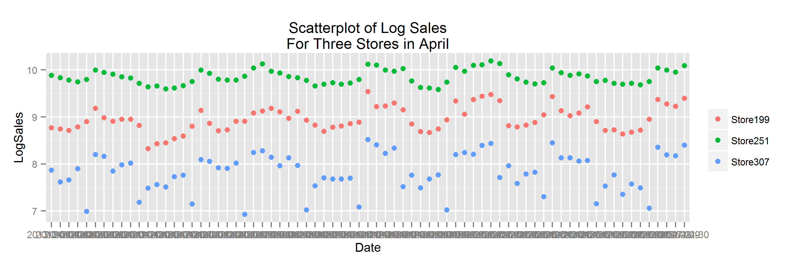
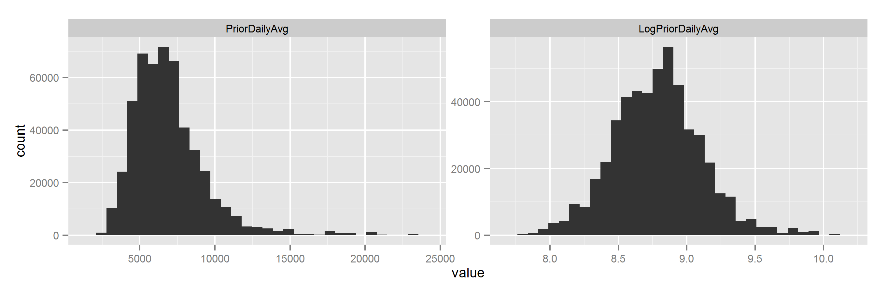
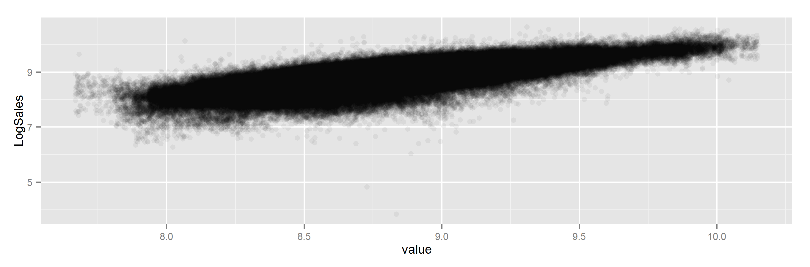

\newpage

# Overview

Rossmann is a German drugstore chain which operates over 3,000 drug stores in 7 European countries. In order to schedule staff effectively, store managers need to predict their daily sales for six weeks in advance.  Rossman decided to create a Kaggle competition to find a satisfactory prediction model.

For our project, our team joined this contest and created a model based on the historical data provided by Rossman.  We used R for data exploration and manipulation, to create linear regression models, and to validate our results.   

MORE HERE - TELL THE CONCLUSION, THEN SHOW HOW WE GOT THERE

```{r, echo=FALSE, warning=FALSE, message=FALSE}

##################
# Step 1 - Setup #
##################

rm(list = ls())

# Choose your data
desired_data <- "dataTraining_full.csv"

## Set the pwd
pwd <- "C:\\Users\\Jennifer\\Documents\\COURSES\\STAT_139_Modelling\\project\\Stat-139\\"

#install.packages("lubridate")
library (lubridate)
#install.packages("lme4")
library (lme4)
#install.packages("ggplot2")
library(ggplot2)
#install.packages("moments")
#library(moments)
#install.packages("reshape2")
library(reshape2)
#install.packages("MASS")
library(MASS) # critical for the qqplots with lines!
theme_set(theme_gray(base_size = 10))

source(paste(pwd, "RossmannProject_GetData.R", sep=""))

######################################
# Step 2 - Transform and Derive Data #
######################################       

if(!file.exists(paste(pwd, desired_data, sep=""))) 
{
    getFullData(pwd)
}
dataTraining <- read.csv(paste(pwd, desired_data, sep=""), header=T)
dataTraining <- dataTraining[,-1] # remove row numbers
dataTraining$YearFactor <- as.factor(dataTraining$YearFactor)
dataTraining$ID <- paste(dataTraining$Date, dataTraining$StoreFactor, sep="") # for graphs
```

# The Data

The Rossmann data consisted of two files.  The first file contains store-level data such as:

* Type of store (in terms of its "model" and its overall selection)
* Information about the closest competitor (distance and longetivity)
* Information about that store's particular promotion cycle

The second file contains daily data for each store, such as:

* date (also noting that date's exact weekday, holiday status, and school holiday status)
* whether or not that particular store was open that particular day
* whether or not the store was running a promotion that day
* sales amount and number of customers

Our first step was to combine the two datasets into one flat file.  We also converted certain variables to strings and factors to prevent R from treating them as numerics.  Then, after using all of the data to derive the variables detailed in the next section, we removed the rows of "closed day" data.  After all, the stores consistently posted zero sales when closed, and our model is to predict sales when open.

## Derived Data

While the Rossman-provided data had a huge number of records, we saw the opportunity to add several more interesting columns of variables as well.  For example:

* We converted the rather esoterically-delivered promotion information to determine on exactly which days each store ran exactly how many promotions.
* We analyzed the distribution of distance between stores and their nearest competitors, and derived a "Close Competitor" variable for those with the 10% nearest Competitors.
* We analyzed which stores had summer sales that were at least 150% the level of winter sales, and hypothesized that these might be seasonal, coastally located stores deserving a special indicator variable we called "Summer Boost".
* We noticed that some stores were completely closed for long stretches of time within our dataset, and hypothesized that perhaps, after a lengthy renovation, sales would increase due to a "buzz".  However, we made our "Reopened" dummy variable more subtle than that - it applied to a certain number of days after a store reopened, proportional to the amount of time a store had been closed.  Therefore, whether it was due to a huge renovation or just a long weekend which forced loyal clients to wait to restock their homes, "Reopened" would capture both possible boosts to sales.
* We marked which stores were open on Sundays vs. the stores which were not
* For the years of data after the first year of data, we added a month-by-month "PriorYearSales" variable (the average level of sales for that store in the same month but of the prior year).  As this involved then limiting our model to run on 2/3 of our data, and as some of the stores posted zero prior sales due to remodeling, this particular variable was not very popular within the team.
* Most significantly, we analyzed the dates within our dataset and added several dummy and factor-level variables to distinguish some dates from others.  We combined the school calendar information with basic knowledge of the seasons to create a rather specific "Season" variable - some periods of time may fall under more generic factors such as "Spring", or "Fall Break" while other dates are as specific as "Christmas Eve".
  
_(Please see the appendix for the complete list of all variables, both original and derived.)_

## Checking the Independence Assumption

Grossman's data observations consist of 942 days of sales for each of 1115 stores. As a result, many of the data points are clustered by store:

``````{r, echo=FALSE, warning=FALSE, message=FALSE, fig.height = 3, eval=FALSE}

dset <- dataTraining[dataTraining$StoreFactor %in% c("Store199", "Store251", "Store307") & dataTraining$Month == "April", ]

vplot <- ggplot(data=dset, aes(x=Date, y=LogSales, color=factor(StoreFactor))) +  
    geom_point() + theme(legend.title=element_blank()) +
    labs(title = paste("Scatterplot of Log Sales\nFor Three Stores in April", sep=""))
ggsave(file = paste("StoreClusters.png", sep=""))
```


Any linear model not taking this into account would have residuals that were not independent and so be invalid.  Therefore, we expanded our toolset to include a "random effects" model, as provided by the __lmer__ command in R's _lme4_ package.  Unlike R's more basic __lm__ approach, this model allows the predicted intercept for each store to vary, thereby "absorbing" the observed and unobserved differences between stores. In fact, it is even possible, with enough processing power, for a random effects model to allow the slopes of certain variables to vary by store as well.  

Unfortunately for us, a full, varied-slope random effects model required more processing power than any of us had at our disposal. However, we found it reasonable to hope that even the basic, intercept-only, random effects model could overcome this violation of independence within our dataset.

## Checking the Normality Assumption

Our dataset contained remarkably few quantititive variables - most of the information was about various categorizations.  However, those few quantitative variables still required some transformations so that our statistical tools could be accurate.  _Sales_, the response variable, and _Distance from Competition_ were both right-skewed until a log transformation was applied.  However, the total _Number of Promotions_ offered by a store at any one time was originally reasonably symmetric.

```{r, echo=FALSE, warning=FALSE, message=FALSE, eval=FALSE}

# need dataTraining_full
dset <- subset(dataTraining, select=c(ID, Sales, LogSales, CompetitionDistance, LogCompDistance, NumPromos))
dset <- melt(dset)
vplot <- ggplot(dset[,-1],aes(x = value)) + 
    facet_wrap(~variable, scales = "free", ncol=2) + 
    geom_histogram()
ggsave(file = paste("Normality.png", sep=""))
```


As mentioned before, our derived _Prior Sales_ variable could be determined only for the second year on of our data, and so the data set we can use to evaluate it is reduced.  Also, there were quite a number of zero-size outliers within this variable.  Sometimes these were clearly due to previous store closures, but the scale of the data prevented us from investigating each instance.  Given our plan to use a store-specific random effects model approach, we did not pursue this matter deeply, as we did not prioritize the use of this variable.  However, this variable as well, when used, benefits from a log transformation.

```{r, echo=FALSE, warning=FALSE, message=FALSE, eval=FALSE}
dset <- subset(dataTraining, YearFactor %in% c(2014, 2015) & !is.nan(PriorSales) & PriorSales > 5, select=c(ID, PriorSales, LogPriorSales))
dset <- melt(dset)
vplot <- ggplot(dset,aes(x = value)) + 
    facet_wrap(~variable, scales = "free", ncol=2) + 
    geom_histogram()
ggsave(file = paste("Normality_PS.png", sep=""), height=3)
```


\newpage

## Checking the Linearity Assumption

Next, we looked at scatterplots of our response variable, _LogSales_, against each of our quantitative predictor variables.  Happily, we did not see any evidence of nonlinearity:

```{r, echo=FALSE, warning=FALSE, message=FALSE, eval=FALSE}
dset <- melt(dataTraining[ , c("LogSales", "LogCompDistance", "NumPromos")], id.vars = "LogSales")

vplot <- ggplot(dset, aes(x=value, y=LogSales)) + 
    facet_wrap(~variable, scales = "free", ncol=2) + 
    geom_point(alpha=0.05)
ggsave(file = paste("Linearity.png", sep=""), height = 3)
```


```{r, echo=FALSE, warning=FALSE, message=FALSE, eval=FALSE}
dset <- subset(dataTraining, YearFactor %in% c(2014, 2015) & !is.nan(PriorSales) & PriorSales > 5, select=c(LogSales, LogPriorSales))

vplot <- ggplot(dset, aes(x=LogPriorSales, y=LogSales)) +  
    geom_jitter(alpha=0.05, position = position_jitter(width = 0.1))
ggsave(file = paste("Linearity_PS.png", sep=""), height = 3)
```



## Imagining Interaction Terms

Even though we are not expert in the drugstore business, we knew we needed several interaction variables to allow for different slopes for certain variables under certain conditions.  For example, we needed to allow the summer season to have a different magnitude of effect if a store seemed to be a seasonal summer destination, compared to all of the other stores in Germany.  We needed to ensure that the distance from the closest competitor could only matter if that competitor was already open for business.  

Although we didn't know much about the store type that was given to us in the data set, we made the assumption that it represented a significant difference between the stores. Based on that assumption, we tried adding "StoreType" as an interaction term to several of the available independent variables. 

# Creating the Model

## Process

Once we had all of our variables in place, we created a __baseline model__ with only Kaggle-provided data.  Then, we created a __full model__, which could potentially include all of our contributed variables and interaction terms as well (if R found them significant).

\newpage

## Baseline Model

To create our baseline model, allowing for each store to have a different intercept, we used the R code

```{r, warning=FALSE, message=FALSE}
baseline <- lmer( LogSales ~ Month + YearFactor + DayOfWeek_Named + Promo + StateHoliday + SchoolHoliday + StoreType + Assortment + CompetitionOpen + LogCompDistance + Promo2Active + (1|Store), data = dataTraining)
```
to derive this model:

THIS WILL BECOME THE LATEX EQUATION INSTEAD, RIGHT?  AND WE DIRECT THE READER TO THE APPENDIX FOR THE FULL SUMMARY?

```{r, warning=FALSE, message=FALSE, echo=FALSE}
summary(baseline)
```

_(Please see the appendix for the complete summary of the baseline model.)_

## Analysis of Baseline Model

Overall, the standard error of the residuals is about 0.2 and our residuals vary considerably (as the scaled residuals range from -23.83 to 10.3494).  This is not surprising as, given the number of observations being considered, there are bound to be a few extreme values.    

If our model is valid, then we should observe normality of the residuals, constant variance of the residuals, and linearity between the residuals and the fitted values.

```{r, echo=FALSE, warning=FALSE, message=FALSE, eval=FALSE}
ER_fortified <- ggplot2::fortify(baseline)

vplot <- ggplot(ER_fortified, aes(sample = .resid)) + 
    stat_qq() + 
    geom_abline(aes(intercept = mean(.resid), slope = sd(.resid)), data = ER_fortified) +
    labs(title="QQ Plot for residuals\nof baseline model")
ggsave(file = paste("Baseline_QQ.png", sep=""), height=3, width=3)

vplot <- ggplot(ggplot2::fortify(baseline), aes(.fitted, .resid)) + 
    geom_point() + stat_smooth() + 
    labs(title="Residual Plot for\nour baseline model")
ggsave(file = paste("Baseline_ResidFit.png", sep=""), height=3, width=3)
```
 

The above plots show our overall residuals for the entire model.  From the normal QQ plot, it is clear that overall residuals are not perfectly normal.  However, they do seem to be somewhat symmetric and, within 2 standard deviations of the mean (which encompasses `r 1 - 40000/844338` of the data), residuals are exactly normal. This seems quite acceptable. Also, the residual plot of our residuals to fitted values looks like a wonderfully even cloud.  We have a very flat, linear line to describe the relationship, and we see no evidence of "fanning out".

Unfortunately, when we review residuals at the store level, we fail to verify our assumptions.  As the following plots reveal, our residuals form a suspicious pattern.

```{r, echo=FALSE, warning=FALSE, message=FALSE, eval=FALSE}
dset <- subset(dataTraining, select="StoreFactor")
dset$predict <- fitted(baseline)
dset$resid <- resid(baseline)
dset <- dset[which(dset$Store %in% c("Store199", "Store251", "Store307")), ]
#dset <- dset[which(dset$Store %in% c("Store19", "Store25", "Store30")), ]
vplot <- ggplot(dset, aes(sample = resid)) + 
    stat_qq() + 
    geom_abline(aes(intercept = mean(resid), slope = sd(resid)), data = dset) +
    labs(title="QQ Plot for residuals\nof baseline model with 3 stores")
ggsave(file = paste("Baseline_QQ_3Store.png", sep=""), width=3, height=3)

vplot <- ggplot(dset, aes(x=predict, y=resid, color=factor(StoreFactor))) + 
    geom_point() + theme(legend.position="none") +
    labs(title="Residual Plot for\nour baseline model with 3 stores")
ggsave(file = paste("Baseline_ResidFit_3Store.png", sep=""), width=3, height=3)
```
 

While the residuals are normal, they seem highly nonlinear and heteroskedacistic, fanning out on both ends.

WHAT COULD BE BEHIND THIS, WHAT DOES IT MEAN FOR THE MODEL?


## Full Model

To create our full random effects model, we first needed to identify a subset of all of our derived data and interaction terms of those which seemed truly to have some weight in explaining sales.  

SO, RANDOM EFFECTS DOESN'T DO STEPWISE?

Therfore, we first allowed R to perform a backwards stepwise linear regression model creation process within a simple linear model that included all of our derived data and proposed interaction terms.  At each step, R removed the predictor with the highest p-value until all predictors were significant at the 95% confidence level.  

OR, WE COULD HAVE USED AIC TO DECIDE WHICH VARIABLES TO KEEP.

```{r, warning=FALSE, message=FALSE, eval=FALSE}
pick_vars <- lm( LogSales ~ WHAT VARIABLES EXACTLY????, data = dataTraining)
```

Armed with this selected list of varibles, we then used the R code

```{r, warning=FALSE, message=FALSE}
final <-  lmer ( LogSales ~ SummerMonthDummy*SummerBoost + Assortment*StoreType 
                     + YearFactor + Month + Season + DayOfWeek_Named
                     + StateHolidayDummy + LogCompDistance*CompetitionOpen
                     + SchoolHoliday + SummerMonthDummy + SummerBoost
                     + SundayOpen + StoreType + Assortment + NumPromos                     
                     + Promo + Promo2Active + CompetitionNONE + CloseCompetitor
                     + (1|StoreFactor), data = dataTraining )
```

to derive this model:

THIS WILL BECOME THE LATEX EQUATION INSTEAD, RIGHT?  AND WE DIRECT THE READER TO THE APPENDIX FOR THE FULL SUMMARY?

```{r, warning=FALSE, message=FALSE, echo=FALSE}
summary(final)
```
 
_(Please see the appendix for the complete summary of the full model.)_

## Analysis of Full Model 

### Interpretation of Coefficients

XXX

### Assumptions Check

Overall, a check of residuals shows us:

```{r, echo=FALSE, warning=FALSE, message=FALSE, eval=FALSE}
ER_fortified <- ggplot2::fortify(final)

vplot <- ggplot(ER_fortified, aes(sample = .resid)) + 
    stat_qq() + 
    geom_abline(aes(intercept = mean(.resid), slope = sd(.resid)), data = ER_fortified) +
    labs(title="QQ Plot for residuals\nof final model")
ggsave(file = paste("Final_QQ.png", sep=""), height=3, width=3)

vplot <- ggplot(ggplot2::fortify(baseline), aes(.fitted, .resid)) + 
    geom_point() + stat_smooth() + 
    labs(title="Residual Plot for\nour final model")
ggsave(file = paste("Final_ResidFit.png", sep=""), height=3, width=3)
```
 

Checking at the store-level, we see:

```{r, echo=FALSE, warning=FALSE, message=FALSE, eval=FALSE}
dset <- subset(dataTraining, select="StoreFactor")
dset$predict <- fitted(final)
dset$resid <- resid(final)
dset <- dset[which(dset$Store %in% c("Store199", "Store251", "Store307")), ]
#dset <- dset[which(dset$Store %in% c("Store19", "Store25", "Store30")), ]
vplot <- ggplot(dset, aes(sample = resid)) + 
    stat_qq() + 
    geom_abline(aes(intercept = mean(resid), slope = sd(resid)), data = dset) +
    labs(title="QQ Plot for residuals\nof final model with 3 stores")
ggsave(file = paste("Final_QQ_3Store.png", sep=""), width=3, height=3)

vplot <- ggplot(dset, aes(x=predict, y=resid, color=factor(StoreFactor))) + 
    geom_point() + theme(legend.position="none") +
    labs(title="Residual Plot for\nour final model with 3 stores")
ggsave(file = paste("Final_ResidFit_3Store.png", sep=""), width=3, height=3)
```
 

Again, we see that, while overall our assumptions checks looks promising, linearity is violated at the store-level.

### Performance as Compared to Baseline

To evaluate the final model we compare the residual standard error (s^) of the baseline model to the final model. From the R summary of the baseline model we find $\sigma_{baseline}$ = 0.1999 and for the final model $\sigma_{final}$ = 0.1937. The final model has a lower $\sigma^2$, benefiting slightly from the additional variables and interaction.

# Summary

XXX

## Particular Challenges

Outliers(or other appropriate name)

The baseline model has a few extreme outliers that no doubt impact our model and potentially could improve the some of the concerning patterns in our by store residual plots.  Due to the size of the dataset, we were unable to investigate all outliers thoroughly.  Some of the most extreme outliers in both the baseline model and the model we develop are not as clearly explained and possibly can be attributed to factors outside the scope of the provided dataset.

Discussion of how we did find the Christmas Eve effect.

Using a mixed-effect linear regression model can give Rossmann a single corporate-wide tool to predict daily sales by store in order to effectively staff and restock stores.  In the simple form explored here, allowing only for our model's intercept to vary by store while keeping the impact of our other predictors the same for all stores, we focused on variables that would allow the model to detect differences not only by store, but seasonally and daily as well.  The most significant predictors, in addition to adding store as a random effect, are exactly those that help highlight variability overtime including month and day of the week.  Further, our categorical variable Season (which attempts to track trends over a course of a year including season, school breaks and specific days of interest including Christmas Eve) and our added interaction variables provide our most significant improvements over the baseline model.  As noted above, our model (anything else guys?)...

In fact, the large data set and number of predictors proved to be an issue for most of our inquiry. from trying to set up prediction intervals to attempting to identify which stores are being modeled well and which might need further attention, we were unable to apply many of the techniques that might work well on a smaller scale model.  Simply setting up the data for use took a significant portion of the project. [other issues you all had?]

## Conclusion

While we were able to explore many aspects of model building, the final model can not be used to make economically sound decisions for all Rossmann stores.  One clear improvement to the model might be to let the impact of our fixed effects vary by store.  For example, it is likely that the average increase is sales observed on Mondays is not the same across all stores.  If we were to let the slope vary by store for the day of the week, we would likely see improved results.  However, the size of the data set and number of predictors limited our ability to test more than a few models with varying store intercepts and, unfortunately, no model that allowed for the slope of one of our predictors to vary by store could fully execute.  With sufficient memory, it would be informative to see how accurate the model would be if all of the fixed effects were able to vary across store. 

In addition, assumptions violations persist in our model.  While our only continuous variables have been transformed (sales and competition distance) to be largely symmetrical, and the overall residuals vs. fitted plot is approximately football shaped, the same graphs for individual stores continue to follow a rough U-pattern (or two distinct grouping of residuals).  This suggests low predictions and high predictions are being divided into two distinct groups by our model.  We were unable to determine why this might be but one thought is that the large amount of indicator variables are somehow splitting up predictions into two camps.  If this is the case, alternate approaches to modeling are likely required.

While our model is certainly able to predict sales taking into account the large variation in store size and seasonal variability, problems with the size of the dataset, inability to address all assumptions violations, the abundance of indicator variables lead to the conclusion that linear regression using R is not the best approach to making accurate predictions in this situation.  In all, the shortcomings of the current project provide many opportunities for further inquiry.

# A Fun Aside: The Kaggle Process


The Rossmann Store Sales Kaggle competition closed on Dec. 14 with around 3300 teams worldwide. Our team entered the competition when it was around two thirds done. At this point, the top teams had their models complete and were making slight adjustments to improve their predictions. Scoring is based on root mean square percentage error (RMSPE) on an unknown portion of a test dataset. And the upper half was fairly crowded with a RMSPRE range of around 0.13 to 0.09.

Before we learned about linear mixed models, our first submission was a straightforward multiple linear regression with transformed quantitative variables and scored below the Kaggle Median DayOfWeek Benchmark. At this point we knew something was wrong and learned about the linear mixed model which boosted our ranking dramatically. After adding several derived variables and interaction terms we were able to our final submission to attain an RMSPRE of 0.14785, moving our ranking up hundreds of positions  to around the upper 75%:

We noted that most of the top 25% ranked teams with publicly available scripts used random forest models. With more time, we would consider using other modeling techniques to improve accuracy.

\newpage

# Appendix

## Variables

WILL TRY AGAIN AT COPY / PASTE TO MAKE CONVERSION TO R MARKDOWN EASIER

\newpage

## Coefficient Table, Baseline Model

```{r, echo=FALSE}
summary(baseline)
```

### Commentary on Baseline Model 

DO WE REALLY WANT TO INCLUDE THIS ANALYSIS, OR DO WE JUST INCLUDE THE ONE FOR OUR FINAL MODEL?

The mean log sales, not taking into account store level difference, is 8.758.  Because a majority of the predictors are categorical or indicator variables the effect of each of these are included in the fixed effect model intercept of 8.746.  It can be interpreted as the average log sales of a store type a, selling assortment a, with no promotions active and no holidays on a Friday in April, 2013.  Without promotions, it makes sense that a store with these characteristics would have a lower average than the dataset overall.  

Now looking at store level models, the fixed effect coefficients will not change but the intercepts will.  For store 199, we see the intercept is 8.746+0.199=8.945 while for store 307, the intercept is 8.746-0.790=7.956.  Reviewing store level data might reveal part of the reason for these differences.  The two stores are of different structures (store type and assortment), their competition is quite different and one does not run long term promotions while the other does.   

In reviewing month as an example of the fixed effects, the model shows that holding all other variables constant, log sales in December are predicted to be 0.2087 higher than in April and 0.047 lower in September for each store in our model.  On the original scale, this means the median sales in December are 1.23 times higher than median sales in April holding other variables constant. 95% confidence intervals around all of the fixed effect slope estimates, reveal that month, year, the day of the week, running promotions, the type of store and assortment sold as well as the competition all play a significant role in estimating log sales for these stores.  

\newpage

## Coefficient Table, Full Model

```{r, echo=FALSE}
summary(final)
```

\newpage

## Code

The following module contains the code we used to transform our data:

```{r, eval=FALSE}

# This module provides the functions we need to 
#    obtain our data,
#    transform some variables
#    add derived data
#    and create a new data source file

getFullData <- function(pwd)
{   
    # Read the files
    print("Reading files")
    dataStores <- read.csv(paste(pwd, "store.csv", sep=""), header=T)
    dataSales <- read.csv(paste(pwd, "train.csv", sep=""), header=T)
    
    # Mark which dates are reopening dates before we delete the zero data
    print("Adding reopened data")
    dataSales$Reopened <- addReopenedFlag(dataSales)
    
    # Only keep rows for open stores with positive sales
    dataSales <- dataSales [ dataSales$Sales > 0 & dataSales$Open != 0, ]
    
    # Add store-level derived data
    print("Adding store-level derived data")
    dataStores <- addStoreDerived(dataStores, dataSales)
        
    # Merge the data
    print("Merging the datasets")
    dataTraining <- merge ( dataSales, dataStores, by = "Store" )

    # add date-level derived data
    print("Adding date-level derived data")
    dataTraining <- addDateDerived(dataTraining, pwd)
    dataTraining$LogSales <- log(dataTraining$Sales) 
    
    # export new files by given names
    
    print("Exporting full Stores data")
    write.csv(dataStores, paste(pwd, "dataStores_full.csv", sep=""))    
    
    print("Exporting full Training data")
    write.csv(dataTraining, paste(pwd, "dataTraining_full.csv", sep=""))

    print("Done!")
}

addStoreDerived <- function(dataStores, dataSales)
{ 
    # fix Store factor
    dataStores$StoreFactor <- paste("Store", as.factor(dataStores$Store), sep="")
    
    # A little data supplementation, to override NA values of competitor distance with the average
    dataStores$CompetitionDistance[dataStores$Store %in% c(291, 622, 879)] <- 5458
    
    # Mark if the store is open on Sundays
    dataSales$OpenSundayCheck <- dataSales$Open == 1 & dataSales$DayOfWeek == 7
    dataStores$SundayOpen <- dataStores$Store %in% unique(dataSales$Store[dataSales$OpenSundayCheck == 1])
    dataStores$SundayClosed <- abs(dataStores$SundayOpen - 1)
    
    # Mark which stores are in the closest 10% to their competitors
    dataStores$CloseCompetitor <- dataStores$CompetitionDistance < quantile(dataStores$CompetitionDistance, c(.1), na.rm = TRUE)
    
    # Average sales by store
    # dataStores$AvgSales = tapply ( dataSales$Sales, dataSales$Store, FUN = mean )
    # dataStores$LogAvgSales <- log( dataStores$AvgSales )
    
    # Determine which stores are seasonal stores (high summer sales)
    
    # Average summer/winter sales by store
    dataSales$month = month(as.Date(dataSales$Date))
    dataSales$SummerMonthDummy <- (dataSales$month== 6)|(dataSales$month==7)|(dataSales$month==8)
    dataSales$WinterMonthDummy <- (dataSales$month==12)|(dataSales$month==1)|(dataSales$month==2)
    dataStores$AvgSummerSales = tapply ( dataSales$Sales[dataSales$SummerMonthDummy==1], dataSales$Store[dataSales$SummerMonthDummy==1], FUN = mean )
    dataStores$AvgWinterSales = tapply ( dataSales$Sales[dataSales$WinterMonthDummy==1], dataSales$Store[dataSales$WinterMonthDummy==1], FUN = mean )
    dataStores$SeasonSalesRatio <- dataStores$AvgSummerSales/dataStores$AvgWinterSales
    dataStores$SummerBoost <- (dataStores$SeasonSalesRatio > 1.5)
    
    return(dataStores)
}

addDateDerived <- function(dataTraining, pwd)
{    
    print("Adding quick calculations")
    dataTraining$Month = months(as.Date(dataTraining$Date))
    dataTraining$YearFactor <- as.factor(format(as.Date(dataTraining$Date),'%Y'))
    dataTraining$DayOfWeekDummy <- as.character(dataTraining$DayOfWeek)
    dataTraining$DayOfWeek_Named <- format(as.Date(dataTraining$Date),"%a")
    dataTraining$MonFri <- dataTraining$DayOfWeek_Named == "Mon" | dataTraining$DayOfWeek_Named == "Fri"
    dataTraining$StateHolidayDummy <- dataTraining$StateHoliday != 0
    
    print("Figuring out prior sales")
    dataTraining <- addPriorSales(dataTraining, pwd)
    
    print("Adding competition info")
    dataTraining <- addCompetitionFlag(dataTraining) #$CompetitionOpen
    dataTraining$CompetitionNONE <- abs(dataTraining$CompetitionOpen - 1)
    dataTraining$CompetitionDistance <- dataTraining$CompetitionDistance + 1
    dataTraining$LogCompDistance <- log(dataTraining$CompetitionDistance)
    
    print("Adding promotion info")
    dataTraining <- addPromo2Flag(dataTraining) #$Promo2
    dataTraining$NumPromos <- dataTraining$Promo + dataTraining$Promo2
    
    print("Adding season data")
    dataTraining <- addSeason(dataTraining) # $Season   
       
    return(dataTraining)
}

addCompetitionFlag <- function(dataTraining)
{
    dataTraining$CompetitionOpen <- as.integer ( as.Date ( paste ( dataTraining$CompetitionOpenSinceYear, dataTraining$CompetitionOpenSinceMonth, "1", sep = "-" ), "%Y-%m-%d" ) <= as.Date ( dataTraining$Date ) )
    dataTraining$CompetitionOpen [ is.na ( dataTraining$CompetitionOpen ) ] <- 0 
    
    return(dataTraining)
}    
 
addPromo2Flag <- function(dataTraining)
{
    # Reorder factors for math to determine if we're in the promo2 month
    # Note: the factor order may be different in the test dataset
    
    dataTraining$PromoInterval <- factor ( dataTraining$PromoInterval, levels ( dataTraining$PromoInterval )[c(1,4,3,2)] )
    # Flag to determine eligibility for promo 2
    dataTraining$Promo2Active <- as.integer (
        ( ( as.integer ( format ( as.Date ( dataTraining$Date ), "%Y%U" ) ) > ( ( dataTraining$Promo2SinceYear * 100 ) + dataTraining$Promo2SinceWeek ) )
          & ( ( as.integer ( format ( as.Date ( dataTraining$Date ), "%m" ) ) %% 3 ) == ( as.integer ( dataTraining$PromoInterval ) - 2 ) ) )
    )
    return(dataTraining)
}
addSeason <- function(dataTraining)
{
    dataTraining$Season <- ""
    
    # specific holiday times
    dataTraining$Season[dataTraining$SchoolHoliday == 1 & (month(as.Date(dataTraining$Date)) == 12 | month(as.Date(dataTraining$Date)) == 1)] <- "Christmas_Break"
    dataTraining$Season[dataTraining$SchoolHoliday == 1 & (month(as.Date(dataTraining$Date)) == 3 | month(as.Date(dataTraining$Date)) == 4)] <- "Easter_Break"
    dataTraining$Season[dataTraining$SchoolHoliday == 1 & (month(as.Date(dataTraining$Date)) == 7 | month(as.Date(dataTraining$Date)) == 8 | month(as.Date(dataTraining$Date)) == 9)] <- "Summer_Break"
    dataTraining$Season[dataTraining$SchoolHoliday == 1 & month(as.Date(dataTraining$Date)) == 10 ] <- "Fall_Break"
    
    # super-specific dates
    dataTraining[dataTraining$Date=="2013-12-23",]$Season="HolidayShopping_LastMin"
    dataTraining[dataTraining$Date=="2014-12-23",]$Season="HolidayShopping_LastMin"
    dataTraining[dataTraining$Date=="2013-12-24",]$Season="Christmas_Eve"
    dataTraining[dataTraining$Date=="2014-12-24",]$Season="Christmas_Eve"
    dataTraining[dataTraining$Date=="2013-12-31",]$Season="NYE"
    dataTraining[dataTraining$Date=="2014-12-31",]$Season="NYE"    
    
    # filling in what's left
    dataTraining$Season[dataTraining$Season == "" & month(as.Date(dataTraining$Date)) == 12] <- "Holiday_Shopping"
    dataTraining$Season[dataTraining$Season == "" & (month(as.Date(dataTraining$Date)) == 1 | month(as.Date(dataTraining$Date)) == 2)] <- "Winter"
    dataTraining$Season[dataTraining$Season == "" & (month(as.Date(dataTraining$Date)) == 3 | month(as.Date(dataTraining$Date)) == 4 | month(as.Date(dataTraining$Date)) == 5)] <- "Spring"
    dataTraining$Season[dataTraining$Season == "" & (month(as.Date(dataTraining$Date)) == 6 | month(as.Date(dataTraining$Date)) == 7 | month(as.Date(dataTraining$Date)) == 8)] <- "Summer"
    dataTraining$Season[dataTraining$Season == "" & (month(as.Date(dataTraining$Date)) == 9 | month(as.Date(dataTraining$Date)) == 10 | month(as.Date(dataTraining$Date)) == 11)] <- "Fall"
    
    dataTraining$SummerMonthDummy <- 0
    dataTraining$SummerMonthDummy[ dataTraining$Season == "Summer" | dataTraining$Season == "Summer_Break" ] <- 1
    dataTraining$WinterMonthDummy <- 0 
    dataTraining$WinterMonthDummy[ dataTraining$Season == "Winter" | dataTraining$Season == "Christmas_Break" ] <- 1
    
    return(dataTraining)
}
    
addReopenedFlag <- function(dset)
{

    #print("Sorting table")
    dset <- dset[order(dset$Store, dset$Date),]
    
    # the vector to return
    Reopened <- rep(0, length(dset$Open))
    
    # make a vector of true/false according to if there is a change or not
    diffs <- dset$Open[-1L] != dset$Open[-length(dset$Open)]; #diffs
    
    # make a vector of the last indexes of each particular run 
    idx <- c(which(diffs), length(diffs)); #idx
    
    # this vector counts how long each run lasted
    runs <- diff(c(1, idx)); #runs
    
    # find index values of the last day of each long run and length of each run
    # NOTE: IF HAVE PROBLEMS, MAYBE JUST FLAG 14 DAYS AND UP HERE RATHER THAN 2
    poss <- idx[runs > 2]; #poss
    lengths <- runs[runs > 2]; #lengths
    
    # check each long run to see if it is a run of closures
    numRuns <- length(poss); #numRuns
    #print("Checking runs")
    for(i in 1:numRuns)
    {
        if(dset$Open[poss[i]] == 0) # this run was of closed days
        {
            # mark the first days of REOPENING as "bump"   
            currStore <- dset$Store[poss[i]]
            
            #print(paste("Found one for Store #", currStore, "at index # ", poss[i]))
            
            if(lengths[i] < 5) # long weekend, maybe just one day's bump
            {
                cap <- 1
            }
            else if(lengths[i] < 31) # a month or less closed gives it several days
            { 
                cap <- 5
            }
            else # after longer than a month, give the excitement two weeks
            {
                cap <- 14
            }
            # don't go past our dataset, though
            cap <- min(cap, length(dset$Open) - poss[i])
            #print(paste("For a run of", lengths[i], "cap is", cap))
            j <- 1
            while(j <= cap & dset$Store[poss[i] + j] == currStore)
            {
                #print(paste("Put a 1 in", (poss[i] + j)))
                Reopened[poss[i] + j] <- 1
                j <- j + 1
            }
        }   
    } 
    #print(paste("done.  Reopened has values of"))
    #print(unique(Reopened))
    return(Reopened)
}    

addPriorSales <- function(dset, pwd)
{
    #dset <- dataTraining
    
    # When necessary, we make a file of 2013 and 2014 by store, by month numbers
    if(!file.exists(paste(pwd, "data_PriorSales.csv", sep=""))) 
    {
        print("Making data file")
        makeSalesFile(pwd)
    }
    print("Reading in data file")
    Prior <- read.csv(paste(pwd, "data_PriorSales.csv", sep=""), header=T)
    Prior <- Prior[, -1] # drop column of row numbers
    
    # Then, for every month and store in the dataset we are given, we find the prior year's sales information and put that in the dataset
    dset$PriorSalesKey <- paste(dset$Store, months(as.Date(dset$Date)), (year(as.Date(dset$Date)) - 1), sep="")
    dset <- merge ( Prior, dset, by = "PriorSalesKey", all.y = TRUE )
    dset$PriorSales[is.na(dset$PriorSales) | is.nan(dset$PriorSales)] <- 0
    dset$PriorSales <- dset$PriorSales + 1
    dset$LogPriorSales <- log(dset$PriorSales)
    return(dset)
}

makeSalesFile <- function(pwd)
{
    Sales <- read.csv(paste(pwd, "train.csv", sep=""), header=T)
    Sales <- Sales[year(as.Date(Sales$Date)) < 2015,]
    Sales$MonthYear <- paste(months(as.Date(Sales$Date)), year(as.Date(Sales$Date)), sep="")
    Sales <- Sales[order(Sales$Store, Sales$MonthYear),]    
    SumData <- tapply(Sales$Sales, list(Sales$Store, Sales$MonthYear), sum)
    
    Melted <- melt(SumData)
    colnames(Melted) <- c("Store", "MonthYear", "PriorSales")
    Melted$PriorSalesKey <- paste(Melted$Store, Melted$MonthYear, sep="")
    
    write.csv(Melted[ ,c("PriorSalesKey", "PriorSales")], paste(pwd, "data_PriorSales.csv", sep=""))
}

```